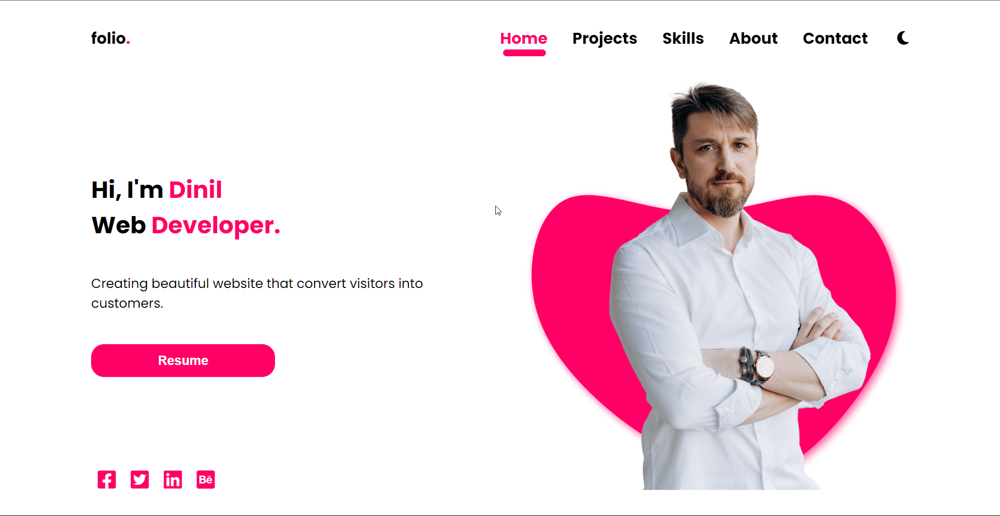

# Portfolio Landing Page with Dark Mode
This is a portfolio landing page built using HTML, CSS, and JavaScript. The landing page features a dark mode toggle button and showcases my skills in web development.

# Demo
Here is a demo of the landing page: https://dinil-thilakarathne.github.io/landing-pages/portfolio%20landing%20page%20with%20dark%20mode/

# Screenshots 
## Desktop view

## Mobile view

# Watch full video on YouTube :

# Watch other video on YouTube :
* Responsive landing page with Dark Theme:https://www.youtube.com/watch?v=4oADFZ589Xs
* Portfolio landing page with dark mode >>> https://www.youtube.com/watch?v=zB41Zw9jUdI
* Portfolio landing page using HTML & CSS >>> https://www.youtube.com/watch?v=Cbu5PeIekIs

# Technologies Used
* HTML
* CSS
* JavaScript

# Getting Started
Clone the repository: git clone https://github.com/Dinil-Thilakarathne/portfolio.git
Open the index.html file in your preferred web browser.

# Features
* Dark mode toggle button
* Responsive design
* Showcase of web development skills
* Contributing
## Contributions are always welcome! Please open an issue or pull request if you have any suggestions or bug fixes.

# Contact
* YouTube: https://www.youtube.com/@sonacode
* Instagram: https://www.instagram.com/sona_code/
## Follow me on YouTube and Instagram to stay updated on my latest web development projects!

# About Me
I am a web developer with expertise in HTML, CSS, and JavaScript. I have a passion for creating modern and responsive web designs. If you have any questions or would like to collaborate on a project, feel free to reach out to me.
